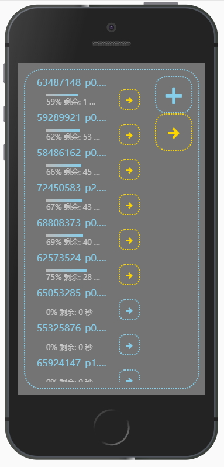

# 基于 HTTP(s)协议的文件传输应用

SPA + Node.js server

使用方式

1. 运行 NPM 脚本: build 或 build-production
2. 在输出文件夹`dist`下有子文件夹`app`和`server`
3. `server`内`server.js`为服务端, 接收文件上传; `app`文件夹为浏览器端, 可以使用静态文件服务器托管
4. 源码在`src`文件夹下, `server.ts`内`uploadDir`常量指定文件保存文件夹

前端预览

TODO:

- [x] 大文件分片传输
- [ ] 断点续传
